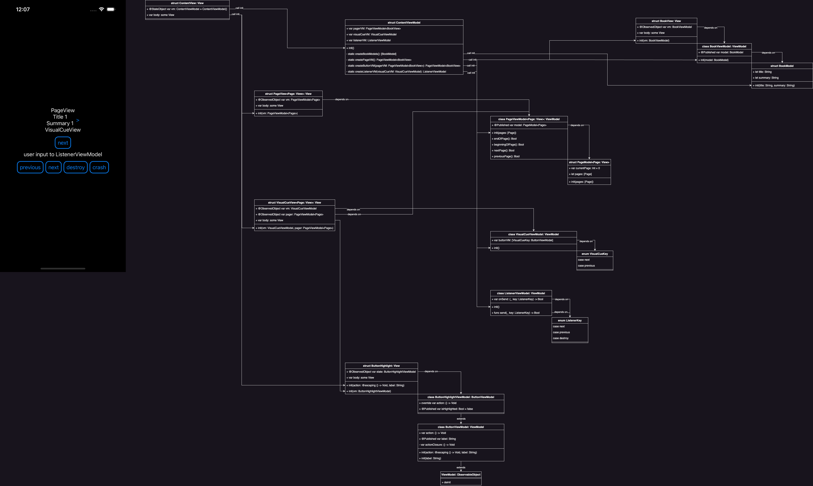

[Class Diagram](https://drive.google.com/file/d/1mLX2hXB4pzoHqoDEmlzInO6ul6atVVtX/view?usp=sharing)

1. "View is just `var body: some View`"
2. "ViewModel is the logic":
    1. `var action: () -> Void = { // define me later in a parent viewmodel }` if the viewmodel trigger other viewmodel.
    2. `func action() { // do internal logic; onAction() }` and `var onAction: () -> Void = { // define me later in a parent viewmodel }`
    2. `func action() { // do something. i.e. get the data from database }`
    3. `var data1: [Model1]`
    4. `var data2: [Model2]`
3. "Model is just `var name: String`"

4. completion handler is bad. async/await pattern is better.

TODO:
- [x] Decouple.

Definitions:
- DEBUG is in preview and in phone, should only use fake data source.
- REELEASE is ONLY in phone, should only use remote data source.
